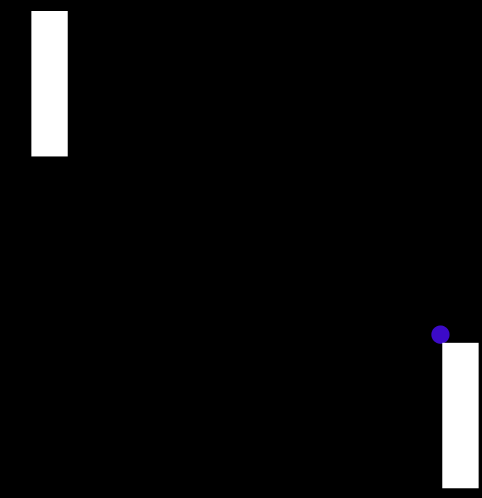
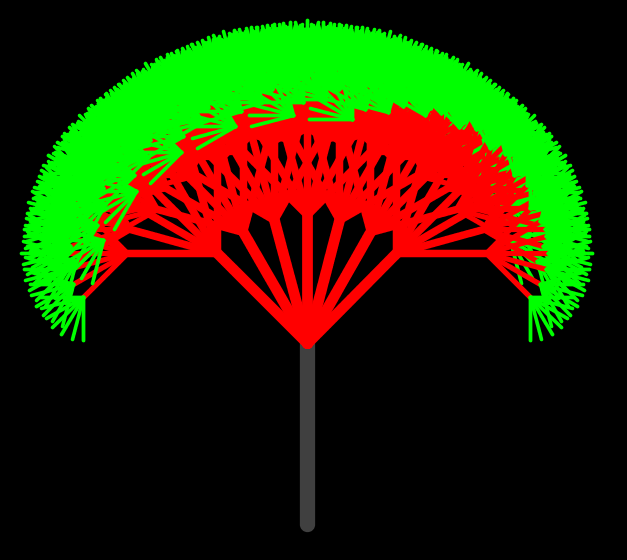

</img>
======================

# 1. About solar-system simulation
## 1.1. 
Escape velocity is the minimum speed that a body must have in order to escape the gravitational attraction of a particular planet or other object.

## 1.2. 
Planets used in the simulating program: 
<ol>
  <li>sun</li>
  <li>earth</li>
  <li>moon</li>
  <li>mercury</li>
  <li>venus</li>
  <li>mars</li>
  <li>jupiter</li>
  <li>satum</li>
  <li>uranus</li>
  <li>neptune</li>
</ol>

Sun: Color.Red  
Earth: Color.Blue 
Mercury: Color.Green 
Venus : RGB(35, 199, 200) 
Mars: RGB(42, 234, 012) 
Jupiter: RGB(55, 23, 123) 
Satum: RGB(244, 100, 012) 
Uranus:RGB(12, 255, 98) 
Neptune:RGB(66, 88, 99) 
Language: Java

## 1.3.

# 2. About 2-D Ping Pong Game
## 2.1
Simple Ping pong 2-D game
Language: Java

</img>

# 3. Recursive Tree
## 3.1
Recursive In-Order traversal of a Binary Tree
Language: Java

</img>
 
</img>

# 4.Required Jar
<h3>For your convenience, stdlib.jar has been uploaded, download and import it</h3>

1. Download the standard libraries called, "stdlib.jar" 
2. Go on "https://introcs.cs.princeton.edu/java/stdlib" then download "stdlib.jar"
3. Open eclipse -> project-> properties->java build path-> libraries-> add external JARs
4. Import the jar file
5. Run the project
