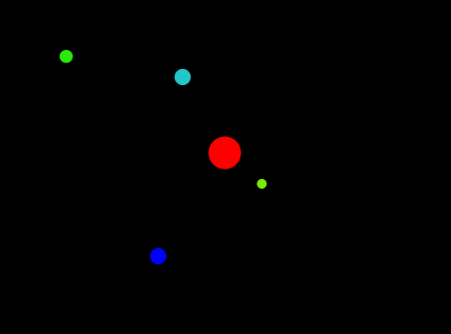

[SPACEBOY] SOLAR-SYSTEM SIMULATION
======================

# 1. About solar-system simulation
## 1.1. what's solar-system?
The solar system can be divided into two groups.
There are two main types of planets in the solar system. 

## 1.2. Inner Planets
The inner planets including Mercury, Venus, Earth, and Mars are smaller, rockier and closer to the Sun. 

## 1.3. Outer Planets
The outer planets including Jupiter, Saturn, Uranus, Neptune are covered in gas.
Only Jupiter and Saturn are visible without telescopes. 

## 2. Required jar 
```
1. Download the standard libraries called, "stdlib.jar." 
2. https://introcs.cs.princeton.edu/java/stdlib 눌러 stdlib.jar 를 다운해준다
3. open eclipse -> project-> properties->java build path-> libraries-> add external JARs-> import the jar file.
4. run the project
```

## 3. Screenshot
</img>
